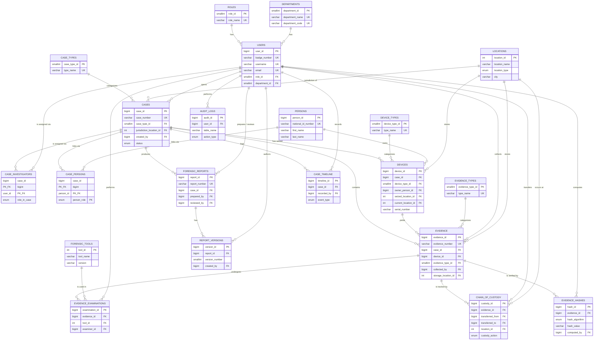

# 04. ER Diagram

**Status:** Complete for Step 2 (MySQL Database Architecture phase)

## 1. Scope

This diagram covers all 21 entities implemented in `database/02_tables.sql`.
Two tables — `case_investigators` and `case_persons` — are **associative
(junction) entities** materializing many-to-many relationships between
`cases`↔`users` and `cases`↔`persons` respectively. They are drawn as full
entities (not plain lines) because they carry their own attributes
(`role_in_case`, `person_role`, timestamps).

## 2. Mermaid ER Diagram



## 3. Cardinality Legend

| Symbol | Meaning |
|---|---|
| `\|\|--o{` | One (mandatory) to zero-or-many |
| `PK` | Primary key |
| `PK_FK` | Column is part of a composite primary key **and** a foreign key |
| `FK` | Foreign key (references another entity's PK) |
| `UK` | Column carries a UNIQUE constraint (candidate key) |

## 4. Relationships Requiring a Nullable FK (optional participation)

Mermaid's crow's-foot notation above always shows the "many" side as
mandatory-parent for simplicity; the following FKs are actually **nullable**
(optional participation), meaning the child row can legitimately exist
without that particular parent:

| Table.Column | Why nullable |
|---|---|
| `cases.jurisdiction_location_id` | Jurisdiction may not be finalized when a case is opened |
| `devices.owner_person_id` | Device owner may be unknown at seizure time |
| `devices.serial_number` | Some devices have no visible/readable serial |
| `devices.seized_location_id` / `current_location_id` | Location may not yet be logged |
| `evidence.device_id` | Evidence is not always device-derived (e.g. a physical document) |
| `evidence.storage_location_id` | Storage location may be pending assignment |
| `chain_of_custody.transferred_from` | NULL only on the very first ("collected") custody entry |
| `forensic_reports.reviewed_by` | A report may still be in `draft`, unreviewed |
| `evidence_examinations.completed_at` | Examination may still be `in_progress` |
| `audit_logs.user_id` | Some audit rows are system/trigger-generated, not user-initiated |

## 5. Many-to-Many Relationships and Their Junction Tables

| Relationship | Junction Table | Extra Attributes Carried |
|---|---|---|
| `cases` ↔ `users` (investigator assignment) | `case_investigators` | `role_in_case`, `assigned_at`, `unassigned_at` |
| `cases` ↔ `persons` (persons of interest) | `case_persons` | `person_role`, `notes`, `linked_at` |

Every many-to-many relationship in the requirement list has a dedicated
junction table with a composite primary key — no comma-separated ID lists
and no multivalued columns appear anywhere in the schema.

## 6. Root-to-Leaf Lifecycle Path

```
cases → devices → evidence → evidence_hashes
                           → chain_of_custody
                           → evidence_examinations
      → forensic_reports → report_versions
      → case_timeline
users → audit_logs
```

This mirrors the project's central principle:
**Case → Person → Device → Evidence → Hash → Chain of Custody →
Examination → Report → Audit Trail.**
