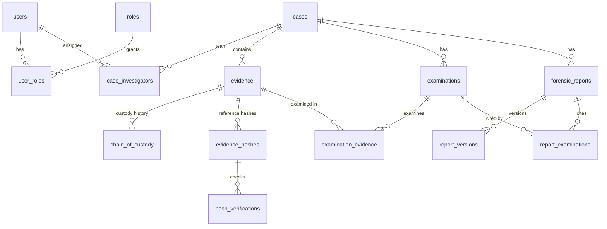

# FORGE-X: Current Architecture (baseline before 2.0)

This describes FORGE-X **as it is now**, so every 2.0 change can be checked against it.

## 1. Overview

| Layer | Technology |
|---|---|
| Browser | Server-rendered HTML (Jinja2) with Bootstrap 5.3, Bootstrap Icons, Chart.js 4 and IBM Plex fonts, all served locally; ~250 lines of plain JavaScript |
| Application | Python 3, Flask 3 application factory, 16 blueprints (69 routes), Flask-WTF forms and CSRF, Werkzeug scrypt password hashing, ReportLab PDFs |
| Data access | `app/db.py`: mysql-connector connection pool, `%s`-parameterised helpers, `transaction()`, `call_proc()`, MySQL error translation. No ORM |
| Database | MySQL 8.0 (tested on 8.0.46), InnoDB, `forge_x_db`; the app connects as the least-privilege account `forge_x_app` |
| Servers | `flask run` for development; Waitress (`serve.py`) for production; optional Cloudflare Tunnel |
| Tests | pytest: 184 tests (72 offline, 83 read-only database, 29 opt-in write); SQL verification scripts |

```mermaid
flowchart TB
  B[Browser<br/>Jinja2 pages, Chart.js] -->|HTTPS form posts + CSRF token| R
  subgraph Flask application
    R[Routes, 16 blueprints<br/>forms, rendering, JSON] --> A[Access control<br/>login_required, roles_required, case scope]
    A --> S[Service layer<br/>business rules, transaction&#40;&#41;]
    S --> D[db.py<br/>pool, %s parameters, error translation]
  end
  D -->|forge_x_app account| M
  subgraph MySQL 8.0: forge_x_db
    M[33 tables 3NF/BCNF] --- T[41 triggers<br/>append-only, integrity rules]
    M --- P[12 procedures, 2 functions<br/>one transaction each]
    M --- V[8 views]
  end
```

## 2. Code layout

| Path | Responsibility |
|---|---|
| `app/__init__.py` | Factory, CSRF, security headers (CSP, `nosniff`, `DENY`, `no-store`, `noindex`, HSTS over HTTPS), blueprint registration, optional Cloudflare proxy handling |
| `app/config.py` | `.env` settings; refuses to start with a placeholder secret key or the MySQL root account |
| `app/db.py` | Pool, query helpers, transactions, procedure calls, `@app_user_id`/`@app_ip` per connection for trigger auditing |
| `app/access.py` | Permission rules shared by all modules; `Scope` adds the case filter for investigators |
| `app/audit.py` | Writes `audit_logs` rows (inside the caller's transaction when given a cursor) |
| `app/errors.py`, `app/ui.py`, `app/pagination.py` | Error pages with incident codes; navigation and template filters; pagination |
| `app/cli.py` | `check-db`, `create-admin`, `set-password`, `seed-mock` |
| `app/storage/` | Evidence file storage: `LocalStorage` (default) and `S3Storage` (MinIO/AWS S3) behind one interface; `migrate.py` moves files with verification |
| `app/mockdata.py` | Demonstration data builder (developer command only) |
| `app/<module>/` | `routes.py` (HTTP), `services.py` (rules and SQL), `forms.py` |
| `app/templates/` | `base.html`, 3 layouts, partials (sidebar, topbar, flash), `macros/ui.html`, 45 templates in total |
| `app/static/` | `forge-x.css` (design tokens), `layout.css`, `dashboard.css`, `landing.css`; `app.js`, `dashboard.js`, `analytics.js`; `vendor/` |
| `database/` | Schema, triggers, views, procedures, seeds, verification, `app_user.sql`, migrations 001–003 |
| `tests/` | 27 test files; `conftest.py` provides fixtures, the opt-in write switch and pool disposal |

## 3. Modules and routes

| Blueprint | Routes | Main pages and actions |
|---|---|---|
| `public`, `system` | 2 | Landing page; `/healthz` |
| `auth` | 7 | Login, logout (POST), signup, signup confirmation, account, password change, `/home` |
| `users` | 10 | User list (search, filters, inactive view), detail, create, edit details, roles, status, password reset, request approval |
| `dashboard`, `analytics` | 4 | Dashboard; 7 analytics charts; JSON chart endpoints |
| `search` | 1 | Global search with exact-ID jump and SHA-256 prefix search |
| `cases` | 11 | List, create, detail (8 tabs), edit, status, investigators, notes, close, delete (empty only) |
| `evidence`, `locations` | 7 | Evidence list, register, detail (5 tabs), edit; storage locations |
| `integrity` | 3 | Record, verify, correct a hash |
| `custody` | 4 | Custody log, transfer, correction, jump-to-item |
| `examinations` | 12 | List, create, detail (7 tabs), record, start, submit, approve, return, artifacts, cancel, link evidence, PDF |
| `reports` | 9 | List, create, detail with versions, new version, cite examinations, submit, approve, return, PDF |
| `audit` | 3 | Audit timeline, CSV export, security view |
| `api`, `api_web` | 16 | Read-only REST API `/api/v1` (13 GET endpoints incl. OpenAPI), token authentication and rate limits (`app/api/`); API tokens and Developer API pages |
| `graph` | 3 | Relationship graph page; a case's graph and a node's neighbours as JSON (scoped). Drawn by `static/js/graph.js` (dependency-free SVG) |
| `yara` | 10 | Rule library (list, create, versions, scope, cases, enable), scan an evidence file, scan results. YARA itself runs only in the isolated worker `app/yara/worker.py` started by `app/yara/runner.py` |

## 4. Data model

33 tables (22 + `case_notes`, `evidence_files`, `evidence_file_locations`, `examination_artifacts`, `api_tokens` and 6 YARA tables from FORGE-X 2.0), all InnoDB, every foreign key `ON DELETE RESTRICT`. The full column list is in `docs/DATA_DICTIONARY.md`.

The tables fall into these groups:

* **Supporting:** `case_types`, `evidence_types`, `examination_types`, `storage_locations`, `account_requests`, `login_attempts`, `audit_logs`, `reference_sequences`.
* **Append-only (16):** `chain_of_custody`, `evidence_hashes`, `hash_verifications`, `report_versions`, `audit_logs`, `login_attempts`, `examination_evidence`, `report_examinations`, `case_notes`, `evidence_files`, `examination_artifacts`, `yara_rule_versions`, `yara_scans`, `yara_scan_rules`, `yara_matches`, `evidence_file_locations`. Triggers block UPDATE and DELETE, and `forge_x_app` has no privilege for either.

**Key mechanisms:**

* **Generated IDs:** `FX-YYYY-NNNN` (cases), `FX-EV-YYYY-NNNNN` (evidence), `EX-` (examinations) and `RP-` (reports), from `sp_next_reference`. The counter is incremented inside the same transaction, so numbering has no gaps.
* **"At most one" rules:** UNIQUE indexes on generated columns, for one lead per case, one original hash per item and one pending request per email.
* **Integrity result:** `trg_hv_set_result` compares hashes inside MySQL. `v_evidence_integrity` derives each item's status from the latest check of its current hash.
* **Concurrency:** procedures lock rows with `SELECT ... FOR UPDATE` in a fixed order. Stale custody transfers and stale edits are refused.
* **Locking-read rule (D8):** locking reads are only used on tables where `forge_x_app` has UPDATE or DELETE. A test checks this.

## 5. Security controls

| Area | Control |
|---|---|
| Authentication | scrypt hashes; generic errors; equalised timing; lockout after 5 failures per account or 20 per IP in 15 minutes, counted in MySQL; signup needs administrator approval |
| Sessions | Reissued at login; `session_version` ends every session on logout, password change or deactivation; HttpOnly, SameSite=Lax, Secure when hosted; 7-day "keep me logged in" |
| Authorisation | Every non-public route is protected (route-wide test); investigators are scoped to their cases (404 otherwise); permission checks repeated in procedures; refusals audited as Denied |
| Input / output | Flask-WTF validation and CSRF on every POST; Jinja autoescaping (never disabled); CSP `script-src 'self'`; CSV formula neutralising; PDF text escaping |
| Database | Parameterised SQL only (scanned by a test); least-privilege account; no DDL; append-only history |
| Uploads | Verification samples: streamed into SHA-256, 25 MB, allow-listed types, discarded. Evidence files (`app/storage`): write-once, read-only, generated UUID names outside the web root, hashed while written, 100 MB per-route limit, downloads only as audited attachments |
| Errors | Generic pages with an incident code; details only in the server log |

## 6. Roles

Four roles. A user can hold several; their permissions are the union.

| Role | In short |
|---|---|
| Administrator | Everything, except approving reports they wrote and changing their own roles |
| Investigator | Only assigned cases; creates cases (becomes lead), evidence, examinations and reports; records checking out, examining and returning evidence |
| Evidence Custodian | All cases; registers and moves evidence; corrects custody entries and hashes |
| Read-Only Auditor | Reads everything; audit logs, CSV export, security view |

## 7. Request lifecycle (custody transfer)

1. A POST arrives at `/custody/<code>/transfer`. CSRF is checked and the session's user is loaded (`session_version` must match).
2. `login_required`; the item is loaded through `Scope` (404 if not visible); the allowed actions are computed from the role and the item's status.
3. The form is validated.
4. The service calls `sp_transfer_evidence` with the custodian the form was opened with.
5. The procedure:
   1. locks the evidence row and re-checks every rule;
   2. appends the custody entry;
   3. moves the item;
   4. writes the audit row, all in one transaction.
6. On an error, everything rolls back and the user sees a plain message.

## 8. Deployment

Windows 10/11 with the MySQL 8.0 service, a Python virtual environment and `.env` for secrets; **or Docker Compose** (app, MySQL and optional MinIO on isolated networks). GitHub Actions runs lint, the full test suite on MySQL, security scans and a Docker smoke test. See `docs/DEPLOYMENT_GUIDE.md`. Optional public access is through Cloudflare Tunnel, with `TRUST_CLOUDFLARE=1` and the app listening only on 127.0.0.1.
